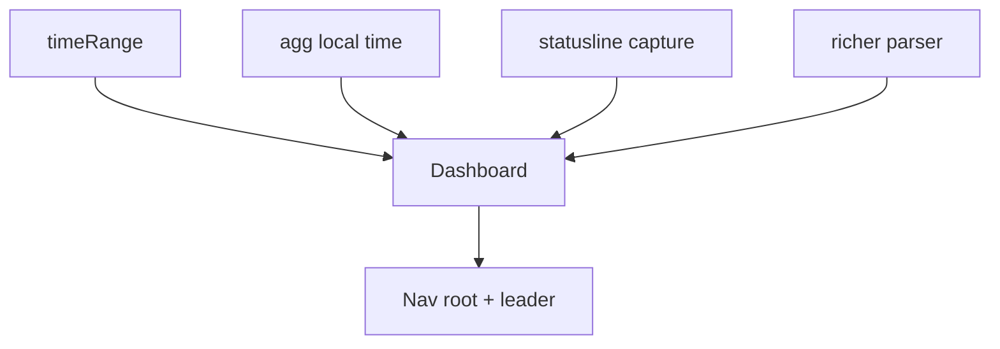
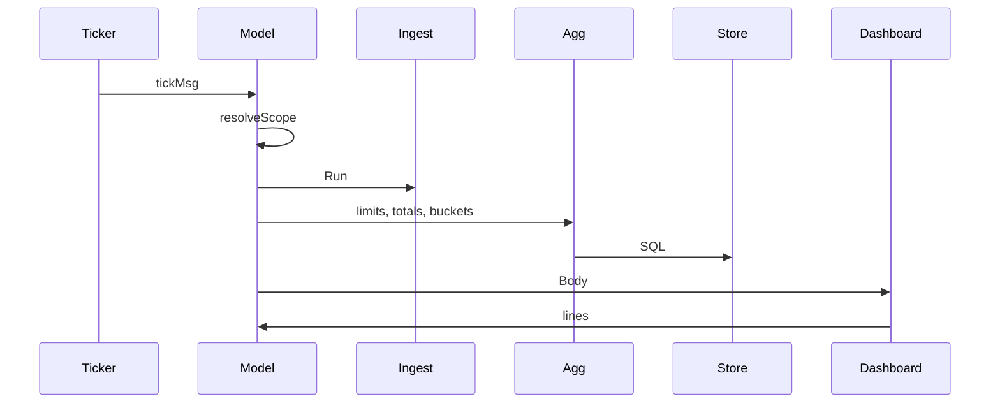

# ccdash analytics dashboard, navigation root, and honest time filter

> [!TLDR] Decision
>
> Make the landing screen an analytics dashboard: a limits strip, a braille
> cost-over-time chart, model and project distributions, and a live session
> strip. Make it the permanent root of the view stack so `Esc` always unwinds to
> it, and reach every other view with a `Space` leader key. Two prerequisites
> ship with it: an honest time filter, and the ingestion fixes without which
> four of the five limit gauges have no live source.

This document revises the Overview direction sketched in
`docs/superpowers/specs/tui-upgrade-guide.md` §3.2 and §9.2. It supersedes that
sketch for the dashboard and time-state work only; the rest of the upgrade guide
stands.

## 1. Problem and constraints

### 1.1 What is wrong today

Four findings, each verified against the running code or the live database on
2026-08-18.

**The time filter freezes and then lies about it.** `setRange` computes
`time.Now().Add(-window)` once at keypress and stores the absolute instant
(`internal/tui/app.go:377`). Leave ccdash open six hours on `d` and the window
is 30 hours wide but still labelled `day`. The header does not disclose this,
because `rangeText()` prints `m.totals.From`/`To` — the extent of matching data,
not the filter bounds (`internal/tui/app.go:442`).

**Day buckets are UTC on a machine that is not.** `dayUTC` cuts days at UTC
midnight (`internal/agg/agg.go:153`) and every timestamp is normalized with
`.UTC()` (`internal/agg/agg.go:88` and `:414`). The development machine runs
`EDT` (UTC−4), so any work after 20:00 local files under tomorrow's date in the
Days view, the Pulse axis, and every `Started` column.

**Four of five limit gauges have no live source.** Verified by querying the
database and the source files directly:

| Gauge         | Source                              | State on 2026-08-18            |
| ------------- | ----------------------------------- | ------------------------------ |
| Claude 5h     | statusline `rate_limits.five_hour`  | no feed; capture not installed |
| Claude weekly | statusline `rate_limits.seven_day`  | no feed; capture not installed |
| Claude Fable  | `~/.claude.json` cached utilization | no feed; that key is empty     |
| Codex 5h      | rollout window at 300 minutes       | no sample since 2026-07-11     |
| Codex weekly  | rollout window at 10080 minutes     | live, minutes old              |

`~/.local/share/ccdash/statusline.jsonl` does not exist, so
`ccdash setup-statusline` has never been run. The three Claude rows in the
archive are from 2026-08-15 with provenance `cached`, and all three are past
their `resets_at`. The Codex 5h row is from 2026-07-14.

**Navigation dead-ends.** A command replaces the whole stack rather than pushing
onto it (`internal/tui/app.go:331`), and `pop()` is a no-op at depth one
(`internal/tui/app.go:356`). So `:sessions` followed by `Esc` goes nowhere.

### 1.2 Constraints

- The archive is designed to grow without bound; `source_file` rows are pruned
  but `request` rows are not (`internal/store/schema.go:29`). Anything on a 2s
  refresh must not scale with total row count.
- 80x24 is a support floor, not a suggestion. Below it the app renders a
  minimum-size message rather than clipped chrome.
- `Renderer` (`internal/tui/view.go:107`) is write-only: it hands a view the
  body and takes back `[]string`, with no path for input to return. `PulseView`
  is inert for this reason.
- Colour never carries meaning alone. Every state that colour expresses also
  appears as a glyph or as text.

### 1.3 Non-goals

- **No panel focus layer.** No `Tab` cycling, no pane expansion, no per-pane
  keymaps. The dashboard has exactly one selectable region.
- **No configurable timezone.** The machine's local zone is used everywhere. A
  `--tz` flag would thread a `*time.Location` through every `agg` entry point.
- **No animated replay or time cursor.** The `LIVE`/`HISTORY` state machine of
  the upgrade guide §3.6 stays unbuilt. This design delivers correct rolling and
  calendar windows only.
- **No new charting primitives.** `internal/render` already provides everything
  needed.
- **No second dashboard page.** One screen.
- **Writing to `~/.claude` beyond what `setup-statusline` already does.** That
  command remains the only operation permitted to modify the user's statusline
  script, and it keeps its diff-and-confirm flow.

## 2. Proposed design

Three workstreams land in dependency order. The time filter is first because the
dashboard's header and its Cost panel are meaningless without it. Ingestion is
second because the dashboard's limit gauges have nothing to draw without it. The
dashboard is third.



The dashboard is one more `Renderer` view rather than a new screen abstraction.
The only new interface is `Selector`, which lets a `Renderer` body own a cursor
so the nav region can be navigated without a focus layer.

## 3. Components

### 3.1 timeRange

**Responsibility:** hold the user's intent declaratively and resolve it to
absolute bounds against a clock, so a rolling window follows the clock instead
of freezing at keypress.

**Interface:** a new file `internal/tui/timerange.go`.

```go
type rangeKind int

const (
    rangeAll rangeKind = iota
    rangeRolling // [now-span, now]
    rangeToday   // calendar day, local
    rangeWeek    // calendar week, local, Monday start
    rangeMonth   // calendar month, local
)

type timeRange struct {
    kind rangeKind
    span time.Duration // rangeRolling only
}

func (r timeRange) bounds(now time.Time) (from, to time.Time)
func (r timeRange) label() string      // "last 7d", "this month", "all"
func (r timeRange) calendar() bool     // true for today/week/month
```

Calendar boundaries are computed with `time.Date(y, m, d, 0, 0, 0, 0, loc)` and
`AddDate`, never with `Add` or `Truncate`. This is load-bearing: a day in
`America/New_York` is 23 or 25 hours across a DST transition, and `Add(-24h)`
gets both wrong.

**Dependencies:** a clock. `Model` gains `now func() time.Time`, defaulting to
`time.Now`, as the test seam.

### 3.2 agg, in local time

**Responsibility:** bucket and filter in the machine's local zone, expose bucket
resolution, and answer count queries without scanning rows.

**Changes:**

- `.UTC()` becomes `.Local()` at `internal/agg/agg.go:88` and `:414`; `dayUTC`
  becomes `dayLocal`. All nine display sites inherit this through the two
  normalization points.
- `Filter.where()` emits `ts < ?` rather than `ts <= ?` for the upper bound
  (`internal/agg/agg.go:30`). Calendar windows need a half-open interval or a
  request landing exactly at midnight is counted in two months. The TUI is the
  only caller that will ever set `To`, and it does not set it today, so this is
  safe.
- `ByBucket(db, pricing, filter, res)` is added with `ResHour | ResDay`. `ByDay`
  becomes a one-line wrapper so `ByProject`'s sparkline and the existing tests
  are untouched.
- `Counts(db, filter)` is added, returning the per-view row counts the nav
  region prints, computed with `COUNT` and `COUNT(DISTINCT ...)` in SQL.

**Dependencies:** none new.

The `Counts` split matters. Every existing aggregate funnels through `scanRows`
or `scanDetail`, which materialize a `model.Record` per matching row in Go. That
is cheap now — measured at roughly 4 ms over 30,273 rows — but it is linear in
archive size and the nav region needs five counts on every 2s tick.

### 3.3 Statusline ingestion

**Responsibility:** capture the payload Claude Code pipes to the statusline, and
keep the fields the current parser discards.

**Changes:** `internal/source/limits/limits.go:123` currently declares a
`statuslinePayload` containing only `rate_limits`. Verified against the user's
own `~/.claude/statusline-command.sh`, the payload also carries
`context_window.used_percentage`, `context_window.context_window_size`,
`model.display_name`, `session_name`, and `workspace.current_dir`. Capturing
them yields a live context-window fill per active session at no extra ingestion
cost.

This requires a new table, because the data is per-session state rather than a
usage record:

```sql
CREATE TABLE IF NOT EXISTS session_state (
  session      TEXT PRIMARY KEY,
  tool         TEXT NOT NULL,
  name         TEXT,
  cwd          TEXT,
  model        TEXT,
  ctx_used_pct REAL,
  ctx_size     INTEGER,
  observed_at  INTEGER NOT NULL
);
```

**Dependencies:** `store` schema version moves from 2 to 3, with the additive
migration pattern already established at `internal/store/store.go:55`.

> [!WARNING] The Fable weekly gauge has no live feed
>
> The statusline payload carries `five_hour` and `seven_day` only. Per-model
> weekly scope exists solely in `~/.claude.json` under `cachedUsageUtilization`,
> which is empty on this machine. The gauge is retained and renders empty with a
> reason until that key repopulates. This design does not fabricate the value
> from any other source.

### 3.4 DashboardView

**Responsibility:** paint the analytics body, own the nav cursor, and answer
which view `Enter` opens.

**Interface:** implements `View`, `Renderer`, and one new interface.

```go
// Selector is implemented by a Renderer view that owns a cursor its own Body
// paints. The app routes j/k and enter to it. A Selector has exactly one
// selectable region, which is what lets the dashboard carry a selection
// without a focus layer.
type Selector interface {
    Move(delta int)
    Open() (View, bool)
}
```

`DashboardView` is a pointer type so the cursor survives a refresh.
`stackEntry.view` is already an interface, so this costs nothing structurally.

**Dependencies:** `agg.LatestLimits`, `agg.Totals`, `agg.ByBucket`,
`agg.ByModel`, `agg.ByProject`, `agg.Counts`, a new `agg.ActiveSessions`, and
the `render` primitives listed in §3.6.

### 3.5 Navigation

**Responsibility:** make the dashboard the permanent root and give every view a
one-chord address.

**Changes:**

| Action        | Today            | Proposed                          |
| ------------- | ---------------- | --------------------------------- |
| `:sessions`   | replaces stack   | replaces `stack[1:]`              |
| `Esc`         | no-op at depth 1 | pops; no-op only at `[Dashboard]` |
| `Space` + key | unbound          | jump to view from anywhere        |
| `Space Space` | unbound          | return to dashboard               |

A third `inputMode` is added, `modeLeader`. While pending, the footer shows the
legend, so the chord teaches itself; `Esc` cancels it. `Space` is currently
unbound in normal mode, and `␣d` does not collide with the `d` range key because
the leader consumes the following keystroke.

The existing safety property is preserved: a reflexive `Esc` still cannot drop
the user out of the application (`internal/tui/app.go:353`).

### 3.6 Panel layout

At 100 columns the body has 98 interior cells and, at 30 rows, 23 body rows
after four header rows, two border rows, and one footer row.

```text
┌ Limits ─────────────────────────────────┬───────────────────────────┐
│ Claude 5h    ███░░░ 31% 4h12m │ Codex 5h  ░░░░░░  — no sample 07-11 │
│ Claude week  █████░ 52% 2d14h │ Codex week ████░░ 48% 3d19h         │
│ Claude Fable ██░░░░ 19% 2d14h │                                     │
├ Cost · last 7d ─────────────────────────────────────────────────────┤
│ $412.80   avg $59/day · today $88 (+49%) · run-rate $530/wk          │
│      ⣀⣠⣤⣶⣿⣿⣶⣤⣠⣀⣤⣶⣿⣿⣶⣤⣠⣀⣤⣶⣿⣿⣶⣤⣠⣀⣤⣶⣿          max $98 │
│ 08-11                                                        08-18   │
├ Models · 7d ──────────────────┬ Projects · 7d ──────────────────────┤
│ opus-5     ████████ $241  58% │ ccdash        $188 ▁▂▅█▃▂           │
│ sonnet-5   ████░░░░ $118  29% │ markets/data   $121 ▃▅▂█▇▃           │
│ haiku-4.5  █░░░░░░░  $38   9% │ sample-project     $58 ▁▁▂▃▅▂           │
│ 5 others   ░░░░░░░░  $16   4% │ 75 others      $46                  │
└───────────────────────────────┴─────────────────────────────────────┘
 ● ccdash 0.3m · ● cli-tools 4.4m · ● markets/data 5.2m · ○ sample-project 11m
 updated 2s ago · through 15:03:46 · claude ✓ codex ✓   ␣p ␣s ␣r ␣a ␣w ␣m
```

Every primitive this needs already exists in `internal/render`: `BarTrack` for
gauges with a visible empty track, `BrailleDomain` for the cost chart,
`SparklineDomain` for project trends sharing one domain, and `TruncatePath` for
separator-aware path shortening.

Breakpoints map `(cols, rows)` to a layout enum in one function:

| Size          | Composition                                              |
| ------------- | -------------------------------------------------------- |
| 120x36 and up | all panels, chart at full braille height                 |
| 100x30        | all panels, chart at reduced height                      |
| 80x24         | single column: Limits, Cost, Sessions; distributions cut |
| below 80x24   | existing minimum-size message                            |

## 4. Data flow

The primary path is one refresh tick.



`resolveScope()` recomputes bounds from `m.timeRange.bounds(m.now())` into
`m.scope` and every stack entry. It runs on the tick as well as on keypress,
which is what makes a rolling window follow the clock. It performs no database
work, so the ticker does not start doing synchronous SQLite on the UI goroutine;
the existing `applyScope()` keeps that behaviour for the keypress path only.

## 5. Decisions and trade-offs

### 5.1 Status board rejected in favour of analytics

A four-panel scalar board was designed first and rejected. It answered "what is
my quota" but not "where is the money going", which is the question the archive
exists to answer. The cost is that the nav region shrank from a panel with
counts to a footer legend.

### 5.2 Master-detail rejected

A lazygit-style selectable left column with a repainting detail pane was
rejected. It requires the `Screen` and focus layer of upgrade guide §9.2, and
tui-design Law 2 makes master-detail worth its complexity when the object list
is unbounded. Limits are a fixed set of five and live sessions are typically
under ten.

### 5.3 Local time everywhere, rather than local presets over UTC buckets

Filtering a local day while bucketing in UTC splits one local day across two
UTC-labelled rows, which is the incoherence the presets were meant to remove. A
configurable `*time.Location` was rejected as out of proportion: it changes
every `agg` signature.

The accepted cost is a one-time visible change. Existing Days rows re-label and
their totals redistribute across the boundary, and four test files currently
pinning `time.UTC` must pin an explicit location instead.

### 5.4 Codex 5h retained rather than retired

Retiring the gauge was proposed and reversed. Codex emitted a 300-minute window
until 2026-07-11 and has sent only the 10080-minute window since. `kindFor`
already maps 300 to `KindCodex5h` correctly
(`internal/source/codex/codex.go:96`), so a resumed feed needs no code change. A
present-but-empty gauge states the absence; a removed one hides it.

### 5.5 Projection shown only for calendar ranges

A projected end-of-window figure is meaningful when the window has a known end.
For a rolling range there is no end to project to, so the slot shows a run-rate
instead. Showing "projected week" under a rolling 7-day window would invent a
boundary the filter does not have.

### 5.6 Remainder row rather than top-N alone

Three models summing to `$397` under a `$412.80` headline teaches the reader
that the numbers do not reconcile. The remainder row costs one line. Models with
no rate contribute to it as a count and never as `$0`, preserving the em-dash
rule established in commit `7ef4b4f`.

## 6. Failure modes

| Condition                     | Behaviour                                    |
| ----------------------------- | -------------------------------------------- |
| Limit has no sample           | empty track, em dash, reason text            |
| Limit sample past `resets_at` | empty track, `expired`, no fill              |
| Limit above 100%              | saturated track plus `!`, never silent clamp |
| Limit stale beyond one hour   | amber plus `⚠` and the age                   |
| No active sessions            | bordered strip with a line saying why        |
| Ingest fails for one tool     | that tool marked `✗` in the freshness line   |
| Refresh wedged                | age goes amber past 30s, red past 5m         |
| Every model unpriced          | em dash headline, distribution shows counts  |
| Terminal below floor          | minimum-size message, `q` and `Ctrl-C` live  |

The governing rule for gauges: a filled track is a spatial claim about the
present. A gauge with no live sample renders its empty track and the reason,
never a fill from a dead sample. This is what turned the Codex 5h disappearance
into a visible absence rather than a confident `55%` for a window that reset 37
days earlier.

## 7. Testing strategy

Tests are written before the code they cover.

- `timeRange.bounds` against a frozen clock across all five kinds, including
  2026-03-08 and 2026-11-01 in `America/New_York` for the DST gap and fold.
  Those are the 2026 transitions, verified: the local day is 23 hours on the
  first and 25 on the second.
- A rolling window advances: resolve, advance the clock one hour, resolve again,
  assert `From` moved. This is the regression test for the freeze.
- `rangeText` reports filter bounds when the data extent differs from them.
- `where()` excludes a row whose `ts` equals `To` exactly.
- A record at 2026-08-17 21:30 EDT buckets to 08-17, not 08-18.
- `ByBucket` at hour resolution over a six-hour window.
- Gauge rendering for each row of the failure-mode table.
- `Esc` from depth three reaches `[Dashboard]` and then stops.
- A leader chord jumps from a drilled view and leaves the dashboard at index 0.
- Panel arithmetic at 80x24, 100x30, and 120x36, asserting the freshness line
  lands on the last body row at every size.
- Distribution rows plus the remainder equal the headline total.

Existing tests needing updates: the four files pinning `time.UTC`
(`agg_test.go`, `unpriced_test.go`, `views_test.go`, `views_unpriced_test.go`),
`TestHelpRowsAreTheKeymapPlusTheCommands` which hardcodes a binding count, and
`TestHelpListsEverySpecBinding`.

## 8. Rollout

Four stages, each independently landable.

- [ ] **Stage 1 — time filter.** `timeRange`, local `agg`, half-open upper
      bound, `ByBucket`, honest `rangeText`, calendar preset keys.
- [ ] **Stage 2 — ingestion.** Run `setup-statusline`, extend the parser, add
      `session_state` at schema version 3, add `agg.ActiveSessions`.
- [ ] **Stage 3 — navigation.** Dashboard as permanent root, `Selector`, leader
      mode, help rows.
- [ ] **Stage 4 — dashboard.** Panels, breakpoints, freshness line, and the
      gauge failure-mode matrix.

> [!WARNING] Another session is editing this repository
>
> As of 2026-08-18 15:09 a concurrent Claude Code session held uncommitted
> changes across `app.go`, `view.go`, `table.go`, `help.go`, `render.go`,
> `pricing.go`, and `go.mod`, and had added `internal/tui/quit.go`. Four of
> those files are ones this design modifies. Confirm that work has landed, or
> take a worktree, before starting Stage 1.

## 9. Open questions

> [!QUESTION] Unresolved before implementation
>
> Does the week start on Monday or Sunday? This design assumes Monday. It is a
> one-line change, but it determines what "this week" reconciles against.

Two values are stated as assumptions rather than derived: the active-session
threshold of 5 minutes and the idle threshold of 60 minutes. Both are inferred
from the observed cadence in the archive on 2026-08-18, not measured against a
stated requirement.
