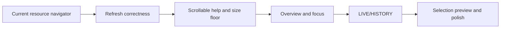
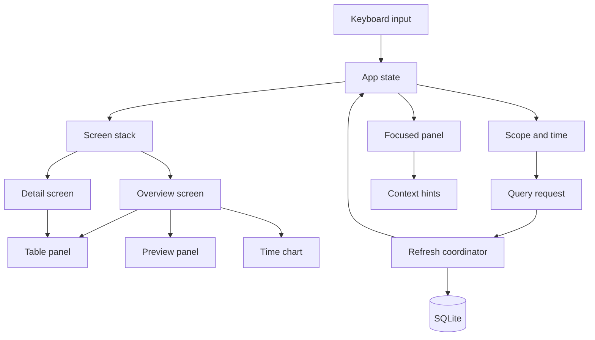
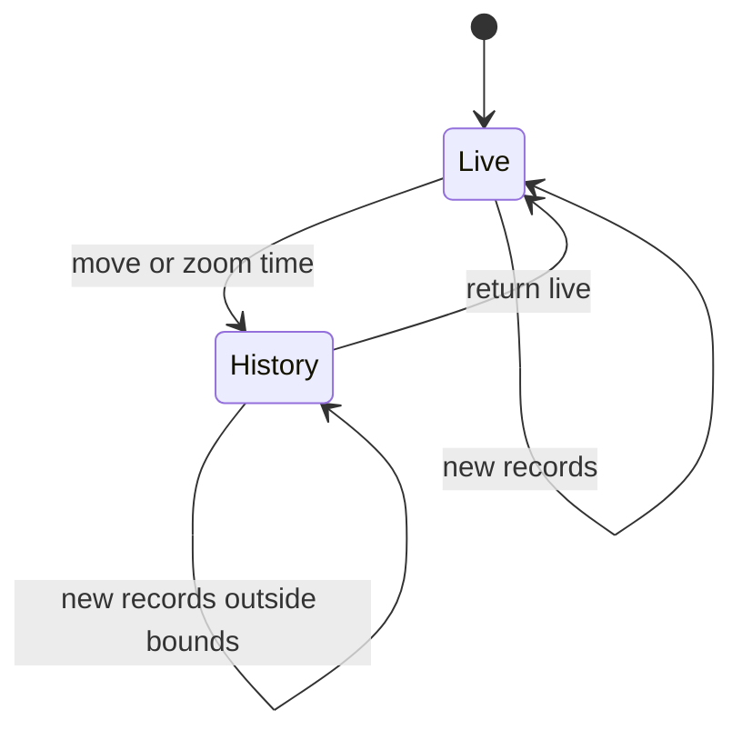
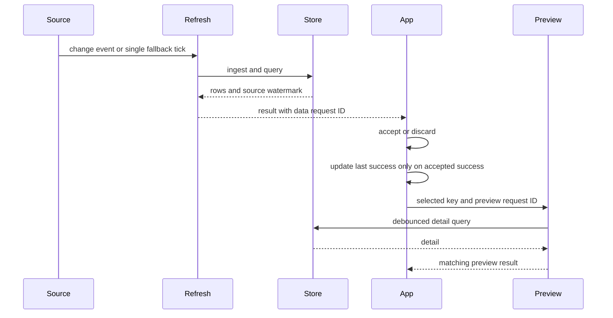

# ccdash TUI Upgrade Report

> [!TLDR] Decision
>
> Keep the current k9s-style navigator, but do not stop there. First fix refresh
> correctness, replace the help layout optimizer with a scrollable table, and
> establish an honest 80x24 support floor. Then add Overview, explicit
> `LIVE`/`HISTORY` state, and an optional selection preview on top of the
> working table, alias, filter, pagination, and drill-stack mechanics.

The help cleanup and the redesign are not competing plans. The cleanup removes
complexity and an accessibility failure from the current shell; the redesign
adds the product model that shell still lacks. This report records the evidence,
the comparative TUI survey, the resulting design, and an implementation order.

It revises the product direction in
`docs/superpowers/specs/2026-08-16-ccdash-k9s-redesign-design.md`. It does not
supersede that document until this report is approved.

## 1. Decision and current state

### 1.1 Recommendation

Adopt a hybrid design:

1. Retain the resource navigator's table, direct aliases, filter, pagination,
   stable selection, and drill stack.
2. Stabilize asynchronous refresh before adding another asynchronous consumer.
3. Replace help's adaptive omission algorithm with a scrollable Help table.
4. Treat 80x24 as the minimum supported application viewport. Below it, render a
   minimum-size message and preserve `q`/`Ctrl-C`; do not render partial
   application chrome.
5. Add Overview, explicit temporal state, and preview as incremental screens and
   panels rather than replacing the navigator.



This resolves the apparent conflict between k9s and the archive-analyzer
proposal. k9s supplies an interaction grammar: address a view, select a noun,
invoke a verb, and unwind a stack. The archive-analyzer proposal supplies the
product model: one usage dataset, explicit time, a synthetic overview, and
detail that follows selection. ccdash needs both.

### 1.2 Current implementation snapshot

> [!NOTE] Snapshot boundary
>
> The source and PTY audit was taken at commit `1109a06` on 2026-08-18. The only
> working-tree item at the boundary was this untracked report.

The navigator is the executable path. The following mechanics are implemented:

- `Table` owns selection, sorting, filtering, scrolling, and key-stable row
  replacement (`internal/tui/table.go:195-251`, `internal/tui/table.go:281-294`,
  and `internal/tui/table.go:417-474`).
- A view stack supports drill and pop navigation
  (`internal/tui/app.go:339-362`).
- Paginated views extend when the cursor reaches the last loaded row
  (`internal/tui/app.go:136-149` and `internal/tui/app.go:226-240`).
- `:` commands, `/` filtering, and `?` help are wired
  (`internal/tui/app.go:203-279`).
- The registry exposes project, model, session, request, agent, workflow, limit,
  day, unpriced, and pulse addresses with aliases
  (`internal/tui/registry.go:6-28`).
- `PulseView` can render outside the table path through `Renderer`, although it
  currently queries during `View()` (`internal/tui/app.go:394-421`).

The current shell is worth preserving. It is not yet the complete product:

- the landing screen is Projects rather than a synthetic Overview;
- rolling range shortcuts do not expose a bounded historical state;
- the footer is not derived from the current view and focus;
- command resolution is exact alias lookup rather than searchable ranking
  (`internal/tui/command.go:5-14`);
- there is no pane focus or selection-synchronized preview;
- freshness currently describes refresh attempts rather than trustworthy data.

### 1.3 Confirmed findings

**Help complexity and omission.**

The help implementation grew from 77 production lines and 143 test lines at
`77a23ea` to 651 and 440 lines at the snapshot. Most of the new production code
is a combinatorial layout system: it chooses fields, columns, chrome,
truncation, and omission (`internal/tui/help.go:451-557`) before rendering the
selected shape (`internal/tui/help.go:560-651`).

That system solves a problem the existing `Table` already owns. A Help table
with `KEY`, `CONTEXT`, and `ACTION` columns can preserve every entry and scroll
through overflow. The current table already implements exact-cell rendering,
viewport clamping, row movement, pages, Home, and End. Reusing it should remove
roughly 500 lines of help-specific production logic; the exact deletion count is
an implementation result, not an acceptance criterion.

The correctness reason is stronger than the line count. At 40x10, the current
overlay renders only six of fifteen bindings, reports nine omitted entries, and
then dismisses on any key. The missing entries are therefore not reachable from
the overlay. At 80x24 all fifteen bindings fit, so this is a cramped-viewport
failure rather than a supported-size regression.

The measured cost of the optimizer is not a release argument. On this machine, a
coarse Go-test timing across 1,800 cramped-size renders was about 1.0 ms wall
time per render after subtracting test-process baseline. That does not establish
a portable 2 ms/frame cost, and Bubble Tea renders on events rather than a
continuous animation loop. Complexity, omission, and test surface justify the
replacement without a performance claim.

**The cramped-size test has a blind spot.**

`TestHelpOverlayFrameHoldsAtCrampedSizes` always checks the outer frame, but it
returns before checking for a visible exit whenever no body row is available
(`internal/tui/help_test.go:421-438`). At 20x3, `bodyHeight` is clamped to one,
the body panel spends that slot on its top border, and `frame` clips the
computed help row (`internal/tui/layout.go:61-70`,
`internal/tui/layout.go:223-240`, and `internal/tui/layout.go:294-322`). The
subtest therefore passes while showing no help content and no visible way out.

Deleting the early return is the correct failing reproduction. It is not the
durable specification: a three-row terminal cannot display the application and
help meaningfully. Replace the test with two explicit contracts:

- below 80x24, the exact-size frame shows a minimum-size message and still
  accepts `q`/`Ctrl-C`;
- at supported sizes, every help entry is reachable by scrolling and the frame
  remains exact.

No size-matrix subtest may silently skip its behavioral assertion.

**Refresh correctness blocks feature expansion.**

Four defects remain in the refresh path:

1. `Init` batches a timer and a refresh, while every refresh result schedules
   another timer (`internal/tui/app.go:159-196`). When the initial refresh lands
   before the initial tick, two timer chains can survive.
2. A refresh captures a view, scope, and page depth, but `refreshedMsg` carries
   no request identity. The result is applied to `m.current()` even if
   navigation changed while the query ran (`internal/tui/app.go:185-195` and
   `internal/tui/app.go:482-533`).
3. `reloadCurrent` performs SQLite work synchronously and is called from normal
   input paths; Pulse also queries SQLite during `View()`
   (`internal/tui/app.go:119-149`, `internal/tui/app.go:331-391`, and
   `internal/tui/app.go:417-421`).
4. `lastRefresh` is overwritten for success and failure with a time captured
   before ingestion and queries begin (`internal/tui/app.go:185-196` and
   `internal/tui/app.go:504-531`). Repeated failures can make old rows appear
   freshly synchronized.

These defects have higher correctness risk than the help overlay and must be
fixed before Overview or preview adds more asynchronous state. Freshness must be
split into `lastAttemptAt`, `lastSuccessAt` at successful completion, and a
`sourceWatermark` derived from the newest source event durably ingested by the
accepted refresh. The header should label those meanings directly, for example
`sync 2s ago` and `data through Aug 18 14:03`.

### 1.4 Current usability evidence

- **80x24:** the complete help keymap and functional navigator render. This is
  mechanically usable at the proposed floor.
- **40x10:** Help omits nine of fifteen bindings, and the omitted rows cannot be
  reached. The partial chrome is misleading.
- **20x3:** the Help body is clipped behind the panel border. Only a
  minimum-size screen should render here.

This is rendering and interaction-path evidence, not a user study. It supports
preserving the navigator and rejecting partial sub-floor layouts; it does not
establish that expert users find the current product usable.

### 1.5 Options considered

1. **Keep only the resource navigator.** It provides a fast address, filter,
   drill, and inspect loop, but no synthetic answer for cost, trend,
   attribution, trust, or bounded time. Reject it as the final product.
2. **Replace it with an archive dashboard.** It provides a strong initial
   summary, but discards working navigation mechanics and makes every detail a
   new dashboard path. Reject it as a rewrite.
3. **Layer archive analysis onto the navigator.** It reuses proven mechanics and
   adds the missing product concepts behind explicit screen, focus, time, and
   asynchronous boundaries. **Adopt this option.**

### 1.6 Priority by impact

The priorities differ depending on the outcome being optimized:

- **Highest correctness risk:** request identity, timer ownership, off-UI-thread
  data access, and truthful freshness.
- **Highest simplification gain:** replace the help layout search with a
  scrollable table and remove dishonest cramped-size coverage.
- **Highest product value:** Overview plus explicit temporal state, followed by
  a selection-synchronized preview.

### 1.7 Product constraints

- ccdash remains local and read-only.
- Existing ingestion, SQLite storage, pricing, and aggregation stay intact
  unless a new index or aggregate query is required.
- API-rate cost must never be described as money actually spent.
- Incomplete pricing, stale limits, and refresh failures must remain visible.
- Keyboard use is primary; mouse support is optional.
- 80x24 is the minimum supported application viewport. Smaller terminals get a
  truthful minimum-size screen, not a partially functional layout.
- Existing direct commands such as `:projects` and `:sessions` remain valid.

### 1.8 Non-goals

- A generic spreadsheet or arbitrary pivot engine.
- A permanent btop-style grid on every screen.
- Animated playback of historical requests.
- A Zellij-like hierarchy of input modes.
- A large tab bar containing every dataset.
- A plugin, theme, or keybinding ecosystem in this upgrade.
- Replacing Bubble Tea, Lip Gloss, SQLite, or the aggregation package.

## 2. Comparative TUI survey

The survey used official documentation, repositories, and project screenshots.
It evaluated navigation, focus, temporal state, responsive composition, help,
and the relationship between selection and detail. The external applications
were not installed and exercised side by side; visual-quality conclusions are
therefore informed design inferences rather than controlled usability results.

- **[k9s][k9s]:** resource prompt, filters, and contextual verbs. Retain aliases
  and the drill stack.
- **[Harlequin][harlequin]:** visible focus, an active footer, and pane
  fullscreen. Add clear focus and panel expansion.
- **[Posting][posting]:** a command palette, jump mode, focused help, and
  density modes. Add searchable actions and contextual help.
- **[bottom][bottom]:** dashboard widgets, freezing, and focused expansion.
  Allow one pane to expand and make pause state explicit.
- **[btop][btop]:** a dense status layout, selection detail, and presets. Use
  compact summaries and reserve color for state.
- **[Yazi][yazi]:** an asynchronous preview that follows the hovered item. Add a
  selected-row preview.
- **[Broot][broot]:** a preview that stays secondary while the list keeps focus.
  Support browsing without forced navigation.
- **[VisiData][visidata]:** derived sheets, row drill-down, and a sheet stack.
  Provide bounded breakdowns and a consistent back stack.
- **[below][below]:** separate live, record, and replay modes. Make temporal
  mode explicit.
- **[svy][svy]:** a time cursor, zoom, exact values, and day boundaries. Add
  historical inspection controls.
- **[Lazygit][lazygit]:** side selection that drives main detail and
  screen-specific modes. Use an adaptive split with panel expansion.
- **[ccboard][ccboard]:** an overview plus three-pane session detail. Treat it
  as the nearest direct feature benchmark.

### 2.1 Findings that transfer directly

**Explicit temporal state is the strongest transfer.** below separates live and
historical operation, while svy lets the user move a time cursor, zoom around an
incident, and read exact values. ccdash already has timestamps and bounded
`From`/`To` filters; the missing piece is an interaction model that exposes
them.

**Selection-synchronized preview fits the stored data.** Yazi invokes preview
work as the hovered item changes, and Broot leaves focus in the source list so a
user can browse several items quickly. A selected ccdash project can show its
trend, top models, sessions, agents, and pricing coverage without replacing the
project table.

**Focus-aware hints reduce memorization.** Harlequin marks focus visibly, can
maximize the focused pane, and renders currently active bindings in its footer.
Posting combines a searchable palette with help for the focused widget. This is
more useful than printing the same global hints on every ccdash view.

### 2.2 Transfers that need constraints

bottom demonstrates a dashboard, widget focus, freeze, and explicit expansion.
The useful transfer is expansion and focus, not a permanent grid. A grid would
compete with the main analytical table at 80x24 and duplicate totals already
shown in the header.

VisiData demonstrates a real sheet stack and derived pivot or frequency sheets.
ccdash should borrow constrained breakdowns such as "this project's cost by
model" or "this day's requests by agent." Arbitrary column selection,
aggregators, and sheet provenance would create a spreadsheet product that the
current workflows do not require.

ccboard is the closest product comparison. Its overview, session detail, live
indicators, palette, and contextual help are useful benchmarks. Its many
top-level destinations are also a warning: capability count is not a substitute
for a coherent navigation model.

### 2.3 Rejected compound conclusion

The survey does not imply that ccdash should combine all of these applications
as one architecture. That would introduce three competing models: dashboard
widget focus, k9s resource navigation, and VisiData sheet manipulation. The
proposal below uses one model and borrows individual behaviors where they fit.

## 3. Proposed design

ccdash becomes a table-first archive analyzer inside a k9s-style navigation
shell. The shell keeps addressable views, contextual actions, instant filtering,
and stack navigation. The product layer adds a synthetic Overview, explicit
time, and selection detail. The header owns global scope, temporal mode,
freshness, and pricing trust. The main screen owns one focused panel. Wide
terminals add a selection-synchronized preview; compact supported terminals
preserve the table and open detail through the existing drill stack. A command
palette reaches every screen and action, while direct `:` aliases remain
accelerators for experienced users.



### 3.1 Mental model

1. **The archive is one dataset with several lenses.** Tool, project, model,
   day, agent, and workflow change the breakdown, not the underlying universe.
2. **Overview, focus, open.** The overview answers the common question; focus
   chooses the active panel; Enter commits to a deeper screen.
3. **Selection previews; Enter navigates.** Moving the cursor is reversible and
   cheap. Opening a selected row pushes a screen onto the stack.
4. **Time is visible state.** `LIVE` follows now. `HISTORY` has fixed bounds and
   does not move under the user.
5. **Hints describe the present context.** The footer shows what the focused
   panel can do, not the union of every application command.

### 3.2 Wide overview

```text
ccdash  HISTORY  2026-08-10 → 2026-08-17  [ALL] claude codex
sync 2s ago  data through 2026-08-18 14:03  pricing 99.6%
$2,012 at API rates   2.4B tokens   23,216 requests   C 43%  X 18%

┌ Projects [20] ─────────────────────┬ Selected: metrics/stocks ────────┐
│ > metrics/stocks   $418  ████████  │ cost/day      ▁▂▃▁▆█▃           │
│   cli-tools        $284  █████     │ models         opus 71%          │
│   infrastructure   $176  ███       │ sessions       42                │
│                                    │ unpriced       0                 │
└────────────────────────────────────┴───────────────────────────────────┘
<Overview> <Projects>  j/k select  enter open  z expand  / filter  : actions
```

The table remains the dominant workspace. The preview is subordinate and does
not take focus when selection changes. `Tab` or a direct focus command moves
focus into it when the user needs to scroll or inspect it.

### 3.3 Responsive layout and support floor

- **Minimum-size — width below 80 or height below 24:** one resize message; `q`
  and `Ctrl-C` remain active.
- **Compact — supported, but width below 120 or height below 30:** semantic
  header, summary, and one table or detail panel.
- **Split — at least 120x30:** dominant table plus selection preview.
- **Wide — at least 180x50:** table, preview, and time chart when the screen
  benefits.

These are acceptance-test breakpoints, not user configuration. A later PTY study
may raise a composition breakpoint, but the 80x24 support floor is a contract.
Crossing a breakpoint changes composition; it does not squeeze the same grid
until actions or data silently disappear.

At compact supported sizes:

- the ASCII logo is absent;
- the database path appears only for a non-default database and may be
  shortened;
- secondary metrics move into Overview detail;
- low-priority table columns disappear by explicit priority;
- Enter opens the selected row as a full detail screen;
- help remains complete through scrolling;
- no row, filter, route, or selection state is lost during resize.

Below 80x24, render a dedicated exact-size frame such as `need 80x24 · q quit`.
Do not run header, body-panel, footer, or help layout and then clip their
output. This makes the support boundary visible and testable.

### 3.4 Header and visual semantics

The persistent header carries information that changes interpretation or trust:

- application identity;
- `LIVE` or `HISTORY`;
- exact range, including the year on both endpoints;
- active tool with an inverse or filled treatment;
- last-success age and source watermark;
- API-rate cost, tokens, and requests;
- pricing coverage or unpriced count;
- compact limit state with provenance when space permits.

The default database path is an implementation detail, not an operational
identity like a Kubernetes production context. Show it only when `--db` selects
another database.

Color has semantic roles and never carries meaning alone:

- accent: focus, selection, and active scope;
- green plus text: live and fresh;
- amber plus a warning marker: stale, incomplete pricing, or nearing a limit;
- red plus text: refresh failure or critical limit;
- dim: secondary metadata and inactive shortcuts.

### 3.5 Interaction grammar

Global bindings:

| Key                 | Action                                    |
| ------------------- | ----------------------------------------- |
| `Tab` / `Shift-Tab` | Move panel focus                          |
| `z`                 | Expand or restore focused panel           |
| `:` or `Ctrl-P`     | Open searchable actions and views         |
| `?`                 | Show help for the active screen and focus |
| `F`                 | Return to live follow mode                |
| `Esc`               | Cancel, close, or pop one level           |
| `q` / `Ctrl-C`      | Quit in normal mode                       |

Table focus:

| Key                 | Action                          |
| ------------------- | ------------------------------- |
| `j` / `k`           | Move selection                  |
| `Enter`             | Open selected row               |
| `/`                 | Filter current table            |
| `s` / `S`           | Change sort column or direction |
| `g` / `G`           | First or last loaded row        |
| `Ctrl-F` / `Ctrl-B` | Page forward or back            |

Time-chart focus:

| Key       | Action                            |
| --------- | --------------------------------- |
| `h` / `l` | Move time cursor                  |
| `H` / `L` | Move the cursor by a larger step  |
| `+` / `-` | Zoom around the cursor            |
| `[` / `]` | Shift the whole historical window |
| `0`       | Reset zoom                        |

Help overlay:

| Key                 | Action                                  |
| ------------------- | --------------------------------------- |
| `j` / `k` / arrows  | Move the visible help cursor            |
| `Ctrl-F` / `Ctrl-B` | Page forward or back                    |
| `g` / `G`           | First or last help entry                |
| `Esc` / `?` / `q`   | Close help without acting on the screen |
| `Ctrl-C`            | Quit ccdash                             |
| Any other key       | No operation                            |

Help does not dismiss on arbitrary input. Its footer is fixed to the help mode,
for example `[j/k] scroll  [Ctrl-F/B] page  [Esc/?/q] close`. In particular, `q`
closes help while `Ctrl-C` quits; they must no longer share one Help row that
claims both quit.

The existing tool and range shortcuts remain. Their active values are visually
selected, not merely listed.

### 3.6 Time-state transitions



`LIVE` means `To` is open and the window anchor advances with current time.
Moving the cursor, shifting, or zooming captures absolute `From` and `To` values
and enters `HISTORY`. In historical mode, ingestion may continue, but the
visible result set does not move unless records inside the fixed bounds change.

No animated replay is required. ccdash records timestamped events and aggregate
cost, not continuously sampled machine state. If quota transition history later
becomes a product requirement, it can be designed separately.

## 4. Components

### 4.1 App and screen stack

**Responsibility:** own global scope, time state, route stack, focus, input
mode, and the identity of the latest asynchronous request.

**Interface:** consume Bubble Tea messages; delegate input to the focused panel;
push, pop, or replace screens; render header, screen, and hint bar.

**Dependencies:** Bubble Tea, the screen registry, refresh coordinator, and
theme. It does not query SQLite directly.

The existing stack and `Scope` remain useful. Add a screen layer above `View` so
a screen may compose several panels without forcing every panel to implement
table behavior.

```go
type Screen interface {
	ID() ScreenID
	Panels(Size, Scope, TimeState) []Panel
	Hints(FocusID) []Hint
	Open(Selection, Scope) (Screen, Scope, bool)
}
```

This is a boundary proposal, not a required final signature. The required
property is that layout and hints belong to a screen while sorting, filtering,
selection, and scrolling remain table responsibilities.

### 4.2 Overview screen

**Responsibility:** answer total usage, cost, trend, primary attribution,
current limits, and data quality without navigation.

**Interface:** expose a dominant breakdown table, a time chart, and a preview of
the selected row. The active breakdown can switch among project, model, day,
agent, and workflow through the palette or a small breakdown menu.

**Dependencies:** existing `agg.Totals`, `agg.ByDay`, attribution queries,
limits, pricing, and unpriced aggregation. A finer chart bucket query may be
added without changing storage.

### 4.3 Table panel

**Responsibility:** preserve the existing table's selection, filtering, sorting,
scrolling, shared sparkline domains, and pagination.

**Interface:** accept rows with stable keys; emit selection changes and open
requests; return focus-specific hints.

**Dependencies:** current `Table`, `View`, and `Paginator` behavior. The panel
does not know how a selected row is previewed.

### 4.4 Preview panel

**Responsibility:** summarize the selected row without changing routes.

**Interface:** receive a stable selection key and scope; render cached detail;
allow explicit focus for scrolling or expansion.

**Dependencies:** aggregate queries and the refresh coordinator. Work is
asynchronous and debounced; selection changes invalidate older preview results.

Recommended preview content:

- project: cost trend, top models, recent sessions, pricing coverage;
- model: project distribution, cache share, recent sessions;
- day: hourly or session breakdown and anomalies;
- session: duration, requests, model timeline, agent attribution;
- request: exact tokens, cost components, provenance, and anomaly state.

### 4.5 Time controller

**Responsibility:** own `LIVE` versus `HISTORY`, window bounds, cursor, zoom,
and bucket resolution.

**Interface:** translate time actions into an `agg.Filter`; format exact range
and cursor values for the header and chart; expose its context hints.

**Dependencies:** a clock abstraction for tests and aggregate queries that can
group at the requested resolution.

### 4.6 Command palette and hint bar

**Responsibility:** make every reachable view and action searchable while
showing only valid immediate actions in the footer.

**Interface:** rank names, aliases, and descriptions; execute an action with the
current screen, focus, scope, and selection; derive hints from the same action
registry so help and behavior cannot drift.

**Dependencies:** screen registry and action registry. Existing exact aliases
remain valid inputs but are not the only accepted matches.

### 4.7 Help table

**Responsibility:** make every binding and address discoverable without adaptive
omission or a second layout engine.

**Interface:** render the existing `Table` with `KEY`, `CONTEXT`, and `ACTION`
columns. Bindings and canonical commands are rows with stable keys. Selection is
the scroll cursor; a visible selected row is acceptable. If that treatment is
too strong in PTY review, add a small table style option rather than another
viewport implementation.

**Input boundary:** help owns navigation and close keys while it is open. It
intercepts or ignores table sorting, filtering, drill, range, and tool keys so
they cannot affect the screen underneath. `q` closes help and `Ctrl-C` quits.

**Dependencies:** reuse `Table` immediately. Initially, adapt the existing
`helpBindings` and command registry into rows. When the action registry lands,
derive help, footer hints, and the palette from it so labels and behavior cannot
drift. The immediate simplification does not need to wait for the palette.

Do not introduce a generic viewport or list component for this. A viewport would
still need a tabular formatter, and a list would add filtering and status
machinery that Help does not need. The existing table already owns the required
cell sizing and scrolling semantics.

### 4.8 Refresh coordinator

**Responsibility:** ingest and query without blocking input, reject stale
results, expose freshness, and recover from failures while retaining the last
good frame.

**Interface:** accept a data request key containing generation, screen ID, scope
hash, time state, and page depth; return a result carrying the same identity.
Preview work has a separate request identity containing selection key. A preview
result cannot advance or overwrite the data generation.

**Dependencies:** ingestion, store, aggregation, and a source watcher or
fallback timer.

> [!WARNING] Stale-result gate
>
> Do not apply a refresh merely to `m.current()`. Navigation can change the
> current screen while a captured query is running. Apply only a result whose
> request identity still matches the target state; otherwise discard it.

The coordinator owns exactly one timer or watcher chain and at most one data
refresh in flight. Manual refresh requests coalesce with an active refresh; they
do not create another timer owner.

Freshness fields have distinct semantics:

- `lastAttemptAt`: when the most recent ingest/query attempt began;
- `lastSuccessAt`: when the entire accepted data request completed successfully;
- `sourceWatermark`: newest source event durably ingested by the accepted
  refresh.

A failure updates attempt/error state only. It never advances `lastSuccessAt` or
`sourceWatermark`, and it never makes retained rows appear fresh.

## 5. Data flow

The primary path is selection in a live overview:

1. The source watcher observes a log change and starts a debounce window. A
   single fallback timer is used when watching is unavailable.
2. The refresh coordinator records `lastAttemptAt` and creates a data request
   identity from generation, screen, scope, time, and page depth.
3. Incremental ingest and aggregate queries run off the UI goroutine.
4. The result returns with the same identity and a source watermark.
5. App discards the result if its identity no longer matches current state.
6. An accepted success records completion as `lastSuccessAt`, advances the
   source watermark, and replaces rows while preserving selection by stable key.
7. An accepted failure preserves the last good rows and timestamps and exposes
   the error plus the age of the last success.
8. A changed selection schedules a separately debounced preview request with a
   different identity domain.
9. The hint bar is recomputed from the active screen and focus.



## 6. Decisions and trade-offs

### 6.1 Hybrid product model instead of either extreme

Direct resource aliases, instant filtering, stable action keys, and a drill
stack remain good. The rejected alternative is making every breakdown and
diagnostic an equal top-level resource. That model loses the overview and
pretends dimensions, detail levels, charts, and trust states are the same kind
of thing. The other rejected alternative is replacing the navigator with an
unrelated dashboard shell and discarding working table and stack mechanics.

### 6.2 Scrollable help instead of adaptive omission

Help uses the existing `Table` and explicit help-mode keys. Every entry remains
reachable, regardless of list length. The rejected alternative is searching a
combinatorial set of column, field, chrome, and omission arrangements for each
viewport. That work cannot make omitted entries accessible and duplicates table
behavior already present in the application.

This decision removes a layout-shape search. It does not reject a future
searchable command palette or optional filtering inside a long help table.

### 6.3 Explicit support floor instead of partial chrome

80x24 is the supported floor. Smaller terminals get a minimum-size message with
quit controls. The rejected alternative is claiming arbitrary tiny viewports as
supported by clipping headers, borders, help rows, and footer content until the
frame dimensions happen to be correct.

### 6.4 Composite Overview instead of a permanent dashboard grid

Overview composes a small number of panels because its purpose is synthesis.
Detail screens stay table-first. The rejected alternative is a btop-style grid
on every screen, which reduces table space and makes compact terminals a special
case everywhere.

### 6.5 Preview before drill

Selection updates a lightweight preview; Enter opens full detail. The rejected
alternative is navigating on every inspection, which creates unnecessary stack
movement and makes comparing adjacent rows slow.

### 6.6 Constrained breakdowns instead of arbitrary pivots

Breakdowns are product-defined dimensions backed by typed aggregate queries. The
rejected alternative is a VisiData-like general pivot engine, which would need
column focus, arbitrary aggregators, derived-sheet provenance, and a much larger
command vocabulary.

### 6.7 Explicit time state instead of unlabeled auto-refresh

`LIVE` and `HISTORY` state is permanent and textual. The rejected alternative is
refreshing every screen without telling the user whether the visible bounds are
moving. A historical investigation must not shift under new events.

### 6.8 Event-driven refresh before a fixed two-second ingest

Prefer source watching with debounce and one in-flight generation. Retain a
configurable fallback timer for platforms where watching is unavailable. The
rejected alternative is copying k9s's two-second interval without measuring
ccdash's file walk, ingest, aggregate, CPU, and I/O cost. Regardless of trigger,
one coordinator owns scheduling and distinguishes attempts, successful syncs,
and source watermarks.

### 6.9 Semantic header instead of permanent implementation detail

Scope, time, freshness, and pricing coverage change how numbers should be read.
The default SQLite path and a large logo do not. The rejected alternative is
spending four permanent rows on those details at every terminal size.

## 7. Failure modes

| Failure                             | Required behavior                                 |
| ----------------------------------- | ------------------------------------------------- |
| Old result returns after navigation | Discard by request identity                       |
| A second refresh trigger arrives    | Coalesce; keep one scheduler and one data request |
| Ingest or query is slow             | Keep input responsive and last good frame         |
| Refresh fails                       | Show error, last-success age, and data watermark  |
| Watcher is unavailable              | Use a measured, configurable fallback timer       |
| Preview selection changes rapidly   | Debounce and discard obsolete work                |
| Selected key disappears             | Clamp predictably and refresh preview             |
| Regex is invalid                    | Keep prior rows and show an inline error          |
| Model is unpriced                   | Show em dash plus coverage warning                |
| Limits are cached or stale          | Show provenance and age beside the limit          |
| Help entries exceed visible rows    | Scroll; never omit an entry                       |
| Terminal drops below 80x24          | Show minimum size and quit controls only          |
| No usage exists                     | Show an empty state with ingest and help actions  |

Refresh failure never clears valid rows. Historical bounds never reopen because
of a background event. Focus never disappears when a preview pane collapses; it
returns to the main table.

## 8. Testing strategy

### 8.1 Unit tests

- minimum-size routing at 79x24, 80x23, and smaller sizes, including exact frame
  dimensions and working `q`/`Ctrl-C`;
- normal application routing at the 80x24 boundary;
- Help table row construction from every binding and canonical command;
- Help movement, paging, first/last, explicit close keys, and ignored unrelated
  keys;
- reachability of the first and last Help rows at each supported composition;
- `LIVE` and `HISTORY` state transitions with a fake clock;
- layout selection at every breakpoint;
- focus movement and expansion;
- hints exactly match valid actions for each screen and focus;
- direct aliases and fuzzy palette ranking;
- selection preservation after row replacement;
- pagination and filter counts;
- preview debounce and stale-result rejection;
- refresh generation rejection after route or scope change;
- one refresh scheduler across startup, manual refresh, success, and failure;
- separate last-attempt, last-success, and source-watermark transitions;
- color-independent text markers for every status.

Remove the early return from `TestHelpOverlayFrameHoldsAtCrampedSizes` first to
preserve a failing reproduction. Then replace that test with named
supported-size and minimum-size contracts. A table-driven test may skip only an
explicitly unsupported capability with a stated assertion for the fallback
screen; it may not return before asserting the behavior its name promises.

### 8.2 Integration tests

Use a temporary SQLite database populated with deterministic records. Drive the
Bubble Tea model with messages rather than only testing rendering helpers.

Required scenarios:

- open Help, scroll through every row, close it, and prove the underlying route,
  scope, filter, and selection did not change;
- launch Overview, select project, receive preview, and drill to sessions;
- navigate while a delayed refresh is running and prove its result is dropped;
- complete startup refresh before the first timer event and prove only one
  future timer is owned;
- fail repeated refresh attempts and prove last-success age and source watermark
  continue aging rather than resetting;
- enter history, ingest a newer record, and prove the bounded view does not
  move;
- return live and prove the newer record appears;
- load more requests, refresh, and preserve both page depth and selection;
- resize wide to compact to wide and preserve route, scope, and selection;
- fail ingest, retain rows, then recover on the next successful refresh.

### 8.3 Real-terminal tests

Capture ANSI-stripped and rendered frames at:

- 80x24;
- 120x30 and 120x40;
- 180x50;
- 79x24 and 80x23;
- 60x16;
- 40x10;
- 20x3;
- 16-color and truecolor terminals;
- Unicode and ASCII-safe graph modes.

Use a real PTY or VHS/tmux capture for the release gate. Unit assertions about
line counts are necessary but cannot detect poor hierarchy, unreadable contrast,
flicker, or terminal-specific key collisions.

Captures below the floor have one expected application behavior: a legible
minimum-size message within the exact terminal dimensions. They are not
reduced-density versions of the normal UI.

### 8.4 Performance evidence

Measure before choosing the final refresh and preview policy:

- warm incremental ingest wall time, CPU, and bytes read;
- aggregate query latency by view and corpus size;
- preview latency while holding `j` or `k`;
- idle CPU and disk activity in live mode;
- input-to-frame latency during refresh;
- memory after paging through the request corpus.

The release gate requires a documented budget and measurements from the real
corpus. A hard-coded interval copied from another application is not evidence.
Help-render timing is a regression signal, not a release gate; the table rewrite
is justified by completeness and simplicity even if both renderers are fast.

### 8.5 Verification commands

```bash
go test ./... -race
go test ./internal/tui -run 'Test(Help|TooSmall)' -count=1 -v
go test ./internal/tui -count=1 -v
go test ./internal/agg -count=1 -v
```

Add the exact PTY capture command to the implementation plan once the harness is
chosen. Do not replace the real-terminal gate with render-unit tests.

## 9. Rollout and migration

### 9.1 Phase 0: stabilize the current navigator

- **Refresh correctness:** add data request identity, establish one scheduler,
  move all SQLite work off the UI goroutine, and split attempt, success, and
  source-watermark timestamps.
- **Help simplification:** adapt bindings and commands to the existing `Table`;
  route help navigation and close keys explicitly; remove layout search,
  omission, and any-key dismissal.
- **Support floor:** route every viewport below 80x24 to the minimum-size screen
  before composing normal chrome.
- **Honest tests:** remove the cramped-size early return; add scroll
  reachability, floor-boundary, stale-result, timer-ownership, and
  freshness-state tests.
- Run the race suite and capture the current and replacement Help behavior in a
  real PTY before considering the phase complete.

Help can initially adapt the existing binding and command data. Do not hold this
cleanup behind the later action-registry refactor.

### 9.2 Phase 1: add the screen and focus layer

- retain `View`, `Table`, `Paginator`, registry aliases, and drill stack;
- add `Screen`, panel focus, contextual hints, and expansion;
- make Overview the landing screen while preserving `:projects` and every
  existing direct resource command;
- render the active tool and range as selected state.

### 9.3 Phase 2: add time state

- introduce `TimeState`, cursor, shift, zoom, and return-live actions;
- add bucket resolution appropriate to the selected range;
- keep historical bounds fixed during background ingestion;
- expose exact cursor values, last-success age, and source watermark.

### 9.4 Phase 3: add preview and responsive composition

- implement project preview as the first vertical slice;
- debounce preview queries and key them independently by selection plus scope;
- provide table-only fallback and full detail at compact supported sizes;
- validate compact, split, wide, and minimum-size layouts in a real PTY.

### 9.5 Phase 4: palette and polish

- replace exact-only command lookup with searchable ranking;
- derive palette, help, and footer hints from one action registry;
- apply semantic color roles and terminal fallbacks;
- benchmark refresh and preview behavior;
- pass the real-PTY release gate.

The migration requires no storage rewrite. Existing direct commands and drill
paths remain compatible. Once the first end-to-end slice passes the release
gate, mark the k9s-specific design and its implementation plan as superseded and
replace them rather than maintaining two active sources of truth.

## 10. Acceptance criteria

- [ ] The existing table, pagination, filter, aliases, and drill stack remain
      available from their direct views.
- [ ] Help renders through `Table`; every binding and canonical command is
      reachable with movement, page, and first/last keys.
- [ ] Help never omits entries, `q` closes Help, `Ctrl-C` quits, and unrelated
      keys do not dismiss Help or mutate the underlying screen.
- [ ] Every viewport below 80x24 shows only a minimum-size message and preserves
      quit controls.
- [ ] Size-matrix tests assert supported or fallback behavior for every case;
      none returns before its named behavioral assertion.
- [ ] Launch presents totals, trend, attribution, limits, and pricing trust in
      one Overview.
- [ ] Active tool, time mode, exact range, sync age, and source watermark are
      always visible at supported sizes.
- [ ] Split and wide layouts show table plus preview; compact supported layouts
      retain full data access through Enter.
- [ ] Selection changes preview without pushing the navigation stack.
- [ ] Enter and Esc push and pop detail screens predictably.
- [ ] The footer shows only actions valid for the current screen and focus.
- [ ] `:` aliases still work and the palette also accepts fuzzy matches.
- [ ] Historical bounds do not move when new records arrive.
- [ ] Returning live incorporates new records without losing selection when the
      selected key still exists.
- [ ] Stale refresh and preview results are rejected by identity.
- [ ] Exactly one refresh scheduler is active after startup, manual refresh,
      success, and failure.
- [ ] Refresh failure preserves the last good frame, last-success time, and
      source watermark while exposing the error and their age.
- [ ] Pricing gaps and stale limit provenance cannot be hidden by layout.
- [ ] Every supported terminal size renders within its exact cell dimensions.
- [ ] `go test ./... -race` and the real-PTY release gate pass.

## 11. Evidence status and survey limitations

### 11.1 Internal evidence

The current-state findings use four forms of evidence:

- source inspection at commit `1109a06`;
- history comparison against `77a23ea`, before the two adaptive-help commits;
- `go test ./... -race` and the targeted cramped-help test;
- live PTY captures at 80x24, 40x10, and 20x3.

The race suite passed at the audit boundary. The targeted
`TestHelpOverlayFrameHoldsAtCrampedSizes` suite also passed, including its 20x3
case; source inspection shows that this specific pass is explained by the early
return before the visible-exit assertion. Passing output therefore establishes
the blind spot, not correct cramped Help behavior.

The coarse Help timing was a local diagnostic, not a benchmark. No conclusion in
this report depends on the claimed 2 ms/frame number.

### 11.2 Independent review disposition

The fresh adversarial pass evaluated five principal conclusions:

- **Confirmed: 3** — disproportionate Help complexity and omission, the 20x3
  test blind spot, and the four refresh correctness defects.
- **Qualified: 2** — reuse `Table` while acknowledging its selected-row styling,
  and preserve the navigator without claiming proven user usability.
- **Refuted: 0.**
- **Unverified: 1** — whether expert users consider the current navigator usable
  in real workflows.

The refresh identity, scheduling, UI-thread query, and freshness findings were
also independently confirmed in two fresh reviews because they block safe
expansion of asynchronous UI behavior.

### 11.3 What was not covered

- implementation of the Help table, support floor, or refresh fixes;
- a red test run with the cramped-size early return physically removed;
- post-rewrite PTY captures and keyboard interaction;
- controlled usability sessions with ccdash users;
- side-by-side installation and PTY recording of every reference app;
- accessibility testing across color-vision profiles, terminal palettes, SSH,
  and multiplexers;
- measured refresh and preview latency on the intended production corpus;
- evidence deciding whether Projects, Sessions, or another breakdown should
  initially own focus inside Overview.

The final Overview focus should be settled with task observation or a small
usage study, not by copying another TUI's default screen.

### 11.4 Survey evidence boundary

The comparative survey uses official project documentation, repositories, and
maintainer screenshots listed below, reviewed on 2026-08-18. The transfer
recommendations are inferences from those documented behaviors and ccdash's
current data model; they are not claims that those maintainers recommend this
architecture. No comparative application was treated as a complete template.

## 12. External references

- [k9s commands][k9s]: resource aliases, filters, help, escape behavior, Pulse,
  and XRay.
- [Harlequin usage guide][harlequin]: focus indication, active footer, pane
  selection, and fullscreen.
- [Posting guide][posting]: compact spacing, command palette, jump mode, and
  focused-widget help.
- [bottom usage guide][bottom]: dashboard composition, widget selection, freeze,
  and focused expansion.
- [btop repository][btop]: selected-process detail, filtering, pause, presets,
  themes, and terminal fallbacks.
- [Yazi previewer documentation][yazi]: asynchronous preview work driven by the
  hovered item.
- [Broot panel documentation][broot]: two-panel browsing and secondary preview
  focus.
- [VisiData sheet documentation][visidata]: table sheets, row opening, and the
  explicit sheet stack.
- [below repository][below]: distinct live, record, replay, dump, and snapshot
  modes.
- [svy repository][svy]: historical cursor, zoom, exact values, and day
  navigation. It is evidence for an interaction idea, not a maturity benchmark.
- [Lazygit repository][lazygit] and [keybindings][lazygit-keybindings]:
  panel-driven detail, search, and screen expansion modes.
- [ccboard repository][ccboard] and [user guide][ccboard-guide]: a direct
  LLM-usage comparison with overview, three-pane sessions, palette, breadcrumbs,
  and contextual help.

[k9s]: https://k9scli.io/topics/commands/
[harlequin]: https://harlequin.sh/docs/getting-started/usage
[posting]: https://posting.sh/guide/
[bottom]: https://bottom.pages.dev/stable/usage/general-usage/
[btop]: https://github.com/aristocratos/btop
[yazi]: https://yazi-rs.github.io/docs/plugins/overview/
[broot]: https://dystroy.org/broot/panels/
[visidata]: https://www.visidata.org/docs/api/sheets
[below]: https://github.com/facebookincubator/below
[svy]: https://github.com/svy-tui/svy
[lazygit]: https://github.com/jesseduffield/lazygit
[lazygit-keybindings]:
  https://github.com/jesseduffield/lazygit/blob/master/docs/keybindings/Keybindings_en.md
[ccboard]: https://github.com/FlorianBruniaux/ccboard
[ccboard-guide]:
  https://github.com/FlorianBruniaux/ccboard/blob/main/docs/GUIDE.md
